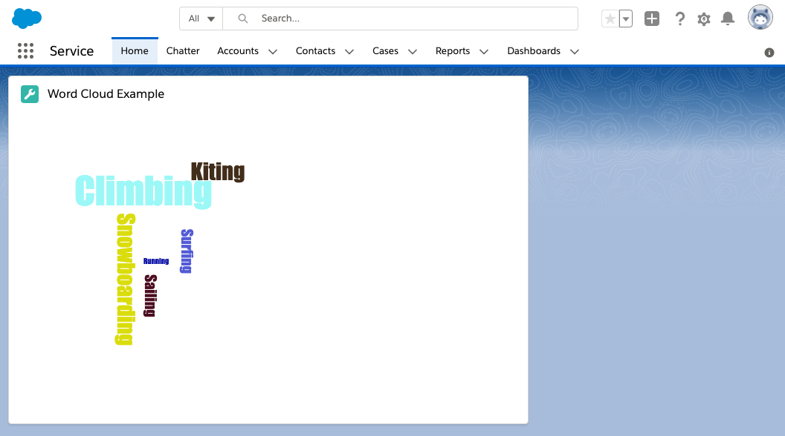

# D3 Word Cloud Ligthning Web Component

This project contains a Lightning Web Component that displays a D3 word cloud. Data for the cloud is loaded from an Apex enpoint.



## Installation

1. Create a scratch org and provide it with an alias (**word-cloud** in the command below):

    ```
    sfdx force:org:create -s -f config/project-scratch-def.json -a word-cloud
    ```

1. Push the app to your scratch org:

    ```
    sfdx force:source:push
    ```

1. Open the scratch org:

    ```
    sfdx force:org:open
    ```

1. Edit a Lightning Home or a Lightning App page with the App Builder and add the **Word Cloud** custom component.
